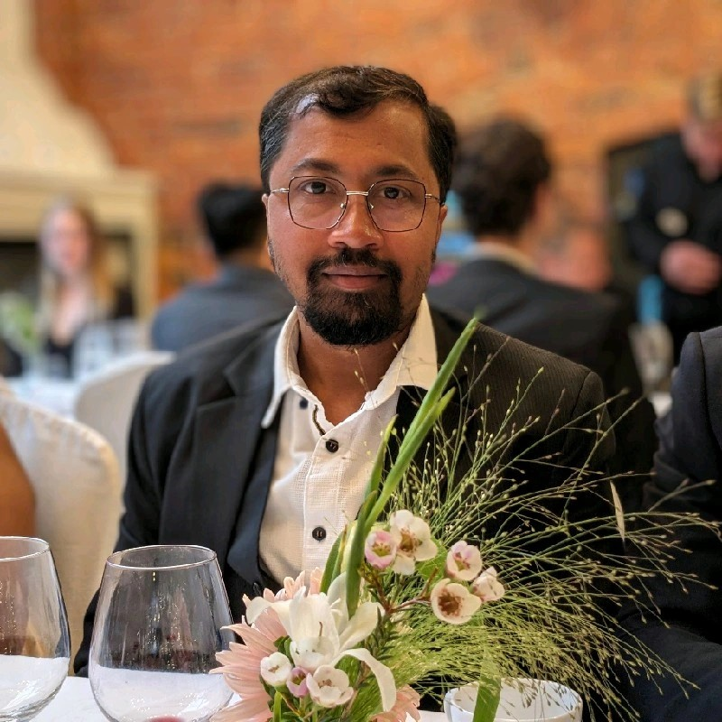

```{r setup, include=FALSE}
knitr::opts_chunk$set(echo = TRUE)
```

::::: {style="display: flex;"}
<div>

{width="150"}

</div>

<div>

-   Computational biologist
-   FAIR information management & visualization
-   Entrepreneur

# 

</div>
:::::

Work in progress 👀
